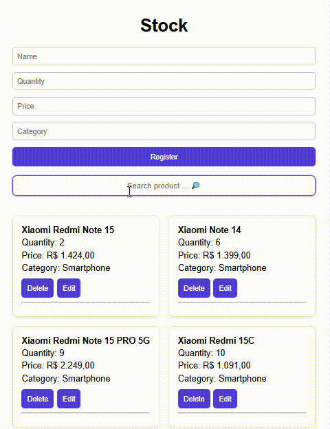
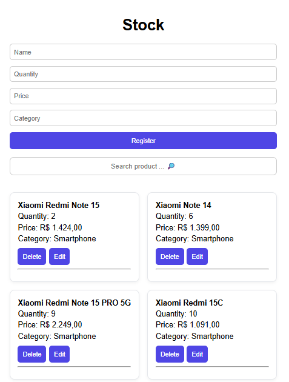
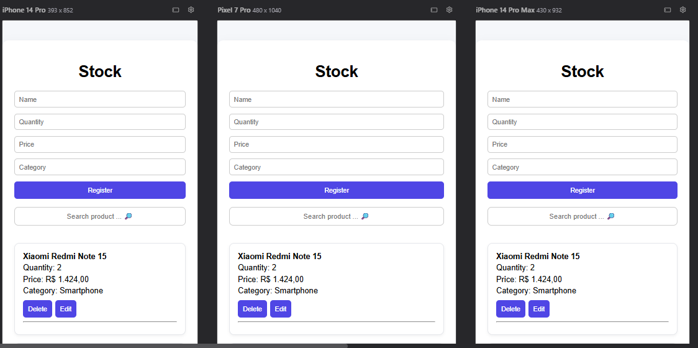
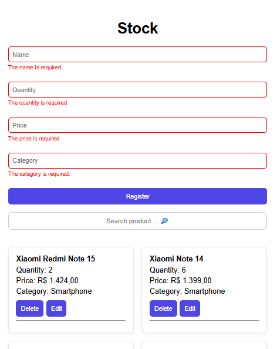

# 📦 Stock Control Frontend

<p align="center">
  
  
  
  
  
  
</p>

---

## 📖 Sobre o Projeto

O **Stock Control Frontend** é uma aplicação web desenvolvida com **React** para gerenciamento de estoque, consumindo uma API REST construída em Java com Spring Boot.

O sistema permite o controle completo de produtos, incluindo cadastro, edição, exclusão e busca, com validações integradas entre frontend e backend.

Este projeto foi desenvolvido com foco em simular um cenário real de aplicação full stack, aplicando boas práticas de organização, UX e tratamento de erros.

---

## 🚀 Deploy

A aplicação está disponível em produção:
➡️ [Site Stock Control](https://stock-control-frontend-kqxm.onrender.com/)

> ⚠️ Por consumir uma API no plano gratuito do Render, a aplicação pode levar até 50 segundos para carregar os dados após um período de inatividade.

---

## 🎥 Demonstração



👉 Foi implementado um **filtro de busca em tempo real**, permitindo localizar produtos dinamicamente conforme o usuário digita.  
A lógica foi construída com manipulação de estado no React (`useState`) e filtragem de arrays.

---

## 🖼️ Interface da Aplicação

### 📋 Home / Listagem de Produtos


A tela principal exibe os produtos cadastrados em formato de cards, com um layout limpo e organizado.  
O design foi pensado para facilitar a leitura das informações e destacar ações como **edição e exclusão**.

---

### 📱 Responsividade


A interface foi construída utilizando **Flexbox**, garantindo adaptação para diferentes tamanhos de tela.  
O layout se ajusta automaticamente para oferecer uma boa experiência tanto em desktop quanto em dispositivos móveis.

---

### ⚠️ Validação de Dados


As validações são realizadas no backend utilizando **Spring Boot**, retornando mensagens estruturadas para o frontend.

👉 Backend do projeto:  
[🔗Stock Control (Java + Spring Boot)](https://github.com/pamella-binotto/Stock-Control)

No frontend, essas mensagens são tratadas e exibidas dinamicamente utilizando **React Hooks (`useState` e `useEffect`)**, permitindo feedback imediato ao usuário com destaque visual nos campos inválidos.

---

## ✨ Funcionalidades

* ✅ Listagem de produtos
* ✅ Cadastro de novos produtos
* ✅ Edição de produtos
* ✅ Remoção de produtos
* ✅ Busca por nome em tempo real
* ✅ Validação de campos (frontend + backend)
* ✅ Feedback visual de sucesso e erro
* ✅ Formatação de moeda (BRL)
* ✅ Layout responsivo
* ✅ Estados de loading

---

## 🛠️ Tecnologias Utilizadas

| Tecnologia | Função |
|----------|--------|
| React | Biblioteca principal do frontend |
| Vite | Ambiente de desenvolvimento |
| JavaScript | Lógica da aplicação |
| CSS | Estilização da interface |
| Fetch API | Comunicação com backend |

---

## 📁 Estrutura do Projeto

```
src/
│
├── components/
│   ├── ProductForm.jsx
│   ├── ProductForm.css
│   ├── ProductList.jsx
│   ├── ProductList.css
│   ├── ErrorMessage.jsx
│   ├── SuccessMessage.jsx
│
├── hooks/
│   └── useProducts.js
│
├── services/
│   └── api.js
│
├── utils/
│   └── format.js
│
├── App.jsx
├── App.css
└── index.css
└── main.jsx
```

---

## ▶️ Como Executar o Projeto

### 1. Clonar o repositório

```bash
git clone https://github.com/pamella-binotto/Stock-Control-Frontend.git
```

---

### 2. Instalar dependências

```bash
npm install
```

---

### 3. Iniciar aplicação

```bash
npm run dev
```

---

## 🧠 Aprendizados

Durante o desenvolvimento deste projeto, foram aplicados conceitos importantes como:

- Gerenciamento de estado com React Hooks  
- Integração com API REST  
- Tratamento de erros estruturados  
- Validação de formulários  
- Organização de código por responsabilidade  
- Manipulação de listas e filtros dinâmicos  
- Experiência do usuário (UX)  

---

## 👩‍💻 Autora

**Pamella Binotto**  
Desenvolvedora Full Stack 🚀
